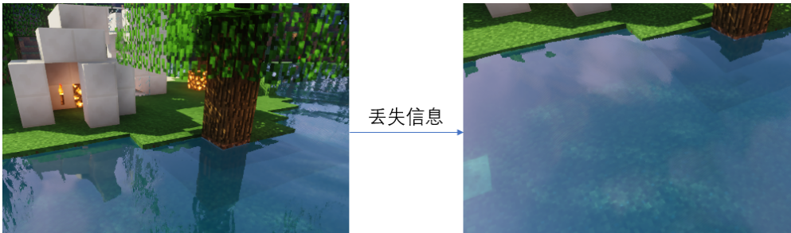
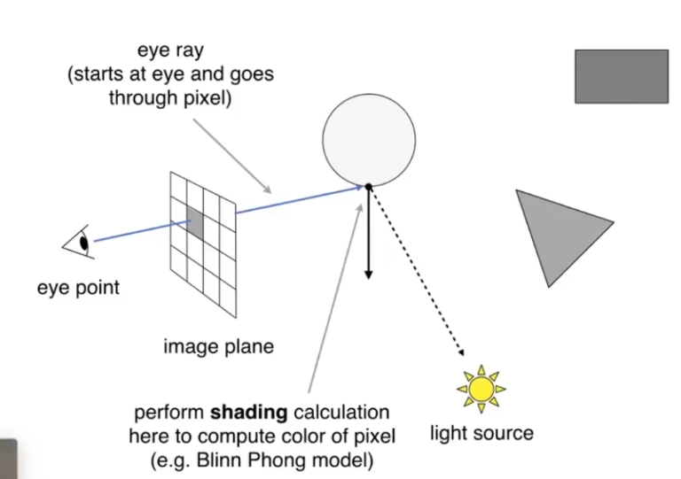
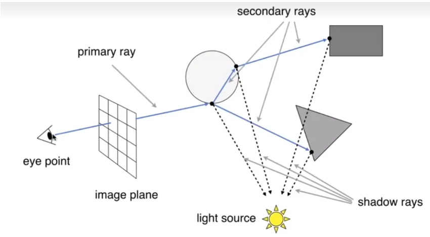

> Date of study: 3 / 2 / 2025
>
> Time of Study: 51 mins
>
> 简单介绍了引入光线追踪的意义，以及一些简单的光线追踪算法，其中有很多细节没有涉及到，如光线与物体相交后，如何求出交点的颜色，光线的反射、折射、散射的该如何计算等，这只是一个引入的部分。
>
> Reference: GAMES101https://www.bilibili.com/video/BV1X7411F744/?spm_id_from=333.337.search-card.all.click&vd_source=46eea21d314849a635f8351c5a0dc4fc
>
> EzRThttps://github.com/AKGWSB/EzRT

# Why RayTracing？

在传统的计算机图形学中，通常使用光栅化的方法来生成像素。因为光栅化之后我们只选取我们看到的图形，视野之外的几何信息被裁剪，导致场景的全局信息丢失。

如下图中，我们的视角没有了白色块，所以系统因为优化等原因，不在场景中渲染白色块，所以水面也不会有白色块的倒影。这就是丢失的全局信息。

一些基于全局**global**信息的渲染效果不能很好的运行，比如全局光照，软阴影，镜面材质反射等。

在光栅管线下我们往往需要通过各种近似算法去模拟真实世界的光影现象，非常麻烦并且效果不够真实。

光线追踪是一种基于物理的渲染方法，尝试模仿光线在现实世界中的行为，包括反射、折射、散射以及阴影的形成等，从而达到与真实世界相近的视觉效果。

光线追踪能够产生高度逼真的图像，特别是在处理复杂光照效果、反射、折射和阴影时，比传统的光栅化渲染方法要自然得多。但光线追踪计算密集型的特性使得它在实时应用（如视频游戏）中的应用受到限制，尽管随着硬件性能的提升和优化算法的发展，这一点正在逐步改善。

# Basic Ray-Tracing Algorithm

## Light Rays

关于光线，我们假定或者认为有三个特点

- 光沿直线传播（实际上在少数情况下光不会沿直线传播，但我们忽略这些情况）
- 光线相互穿过时不会相互“碰撞”，不会相互影响（在特定情况下也是不正确的，但我们忽略这些情况）
- 光从光源到达眼睛，所以我们能看到东西，但路径逆转后不变。也就是光路可逆。

## Ray Casting

### Pinhole camera model

**Pinhole camera model**小孔相机模型是一个简化的相机模拟模型，基于几何光学的原理，通过一个虚拟的“小孔”来模拟光线从场景中传输到观察点的过程。这个模型简化了复杂的光线传播机制，只考虑通过小孔的直线光路，从而在成像平面上形成一个清晰的、倒置的图像。

但实际实现时我们不会真正的去处理一个倒置缩小的图像，而是像上图一样，根据相机参数，在相机前方虚拟建立一个成像平面，平面上的每一点对应于最终图像中的一个像素。

注意这与光栅化成像中的投影变换有很大不同。

### Ray Casting

光线投射是光线追踪技术中最基础的过程之一，它是指从视点（通常是相机或观察者的位置）发射光线，穿过成像平面中的每个像素，直到碰到第一个物体为止的过程。

对于某一个像素，从我们人眼出发经过此像素打到最近的物体点上，（因为打到最近的物体上，所以物体的前后遮挡问题等问题就得到了解决，在光栅化成像中这一问题通过深度缓存来解决），确定了交点之后，将此点与光源进行连接，看看光源是否能到达这个点，如果可以，直接计算这一点的着色记录在像素上。

考虑之前我们认为的光线的光路可逆性质，光源的光达到了物体的某个点上，之后这个点的光线进入了我们的眼睛，所以我们能看到这个点，而光线追踪就是这个过程的逆过程。

根据上面描述的过程，我们发现ray casting作为一个基础过程，忽略了光线之间的相互作用，例如反射、折射或散射，因此通常用于生成简单的阴影和轮廓。只考虑了直接的光源，也就是说只计算了直接光照**direct illumination**。想象一个房间里面，太阳光没有直接照进屋子，但我们还是能看清整个房间，这是因为太阳光照射到了其他物体上，其他物体再反射光到房间中，然后再进入我们的眼睛，这就是间接光照**indirect illumination**。ray casting忽略了光线之间的相互作用，也就忽略了间接光照。

## Whitted-Style Ray Tracing

如果我们考虑光线之间的相互作用，光线碰到物体后，应该会继续反射、折射或散射。

当光线打到光滑（镜面）物体上时，光线会根据反射和折射的物理定律继续传播，当光线打到粗糙表面上时，会发生漫反射（Diffuse Reflection），在Whitted-Style Ray Tracing中，对于漫反射表面，通常不会追踪从这些表面反射的次级光线（因为它们向所有方向散射）。相反，漫反射的处理通常通过计算入射光线与表面法线的角度来简化，以确定表面如何散射光线并计算局部光照。这意味着，对于漫反射表面，光线传播在计算局部光照后"停止"，而不是继续追踪光线的具体散射路径。

如上图，光线到达玻璃球之后仍然进行反射和折射，现在的光线就叫做Sencondary rays。所有的反射折射点都要与光源进行连接判断光源可见性，与光源连接的线叫做shadow rays，之后所有的点都要计算着色结果，然后一同显示在像素上。