> Date of study: 3 / 2 / 2024
>
> Time of study : 96 mins
>
> 辐射度量学是研究电磁辐射（包括可见光）在物质之间传输的量度的科学。在计算机图形学和光线追踪中，辐射度量学的概念和原理被广泛应用于精确模拟光的行为，包括它如何从光源发射、在场景中传播、如何被物体表面吸收、反射或折射，以及如何影响我们看到的场景的最终外观。学习辐射度量学是学习光线追踪的基础。
>
> Reference: GAMES101课程https://www.bilibili.com/video/BV1X7411F744/?spm_id_from=333.337.search-card.all.click

# Radiant Energy

我们日常生活中，有太阳能板，能够接受太阳光转化为热能或者电能，说明光本身是有能量的。

我们定义光的能量为**辐射能量Radiant Energy**，记作Q，单位为J（焦耳）

下面给出英文定义

Definition: Radiant energy is the energy of electromagnetic radiation. It is measured in units of joules, and denoted by the symbol:
$$
Q[J = Joule]
$$

# Radiant flux

**辐射通量，或者说辐射功率**，单位时间的能量，也就是将之前学的Radiant Energy求一个单位时间的值，与功率相似。对于使用flux描述光，一般也会用lumen为单位。

为什么要求一个单位时间的能量。我们思考穿黑衣服晒太阳的过程，刚开始没什么，随着时间的推移我们的衣服会越来越烫，接受的光的能量越来越多；同等条件下，功率越大灯泡越亮。所以为了研究光的能量需要求出单位时间内光的大小。

下面给出英文定义：

Definition: Radiant flux(**power**) is the energy emitted, reflected, transmitted or received per unit time.
$$
\Phi =  \frac{\mathrm{d} Q}{\mathrm{d} t} [W = Watt][lm=lumen]*
$$
还有一种理解方式，光都是光子组成的，如果有一个感光平面，单位时间内通过的光子数量就是flux。

下面我们要学习三个定义，这三个定义可以按照下面的方式理解。

1. 从光源方面，光源发射出去的光怎么定义，我们使用Radiant intensity
2. 从接受方面，如何度量平面接受的光，我们用Irradiance。
3. 从传播方面，光传播时我们使用radiance。

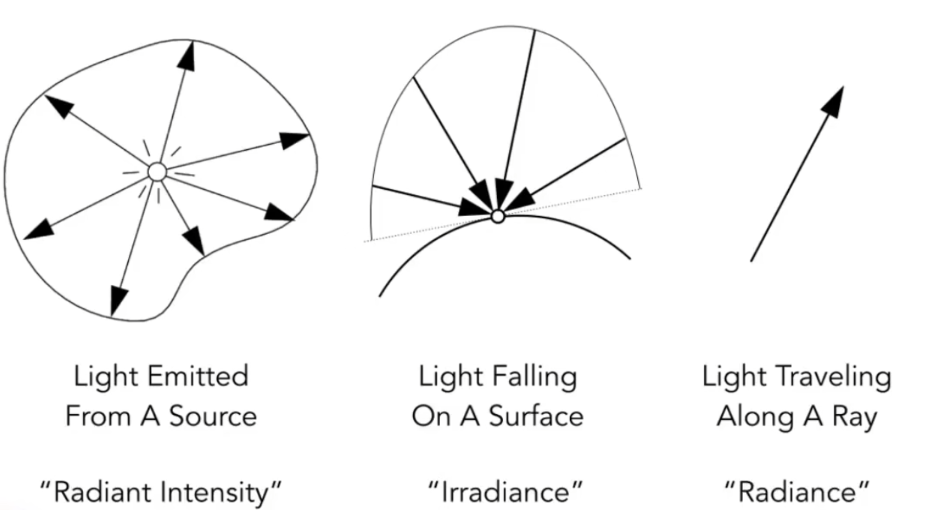

# Radiant Intensity

## Angles and Solid Angles

我们经常使用弧度来定义角**radians**。

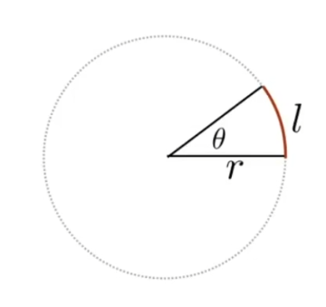
$$
\theta = \frac{l}{r}
$$
圆的弧度是2π

延伸到三维空间中，三维空间中的角**steradians**

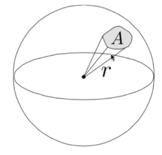
$$
\Omega = \frac{A}{r ^ 2}
$$
一个球有4π的steradians

单位立体角则是我们找一个很小的面积dA

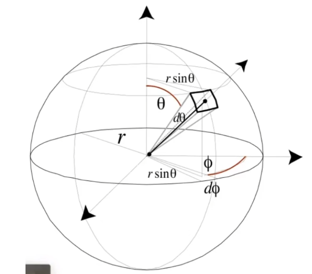
$$
\mathrm{d}A = (r\mathrm{d}\theta)(r\sin\theta\mathrm{d}\phi) = r ^ 2 \sin\theta\mathrm{d}\theta\mathrm{d}\phi
$$
再使用这块很小的面积去求steradians就可以得到单位立体角
$$
\mathrm{d}\omega = \frac{\mathrm{d}A}{r ^ 2} = \sin\theta\mathrm{d}\theta\mathrm{d}\phi
$$
这里的很小的面积dA可能不是很好理解，看下面的这张图

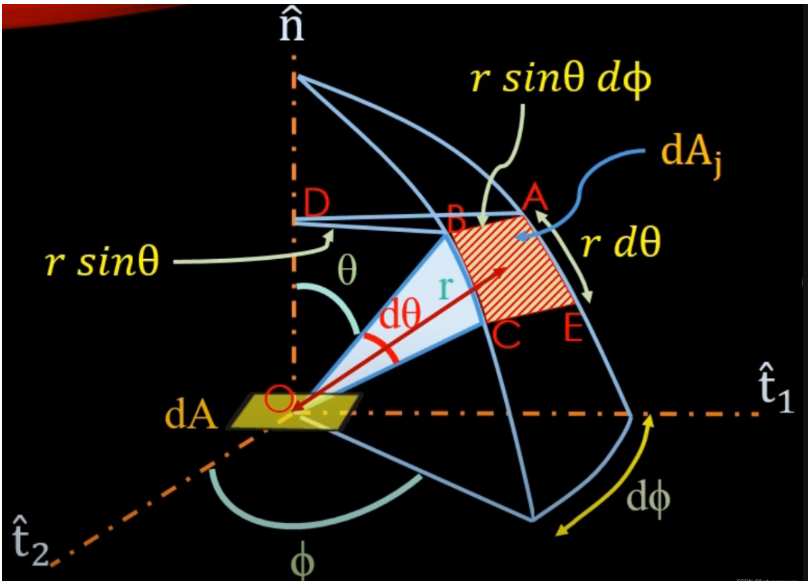

在一个球中，获取一个方向我们可以旋转两个角θ和Φ获得
$$
dA = dAj = AB * BC\\

\mathrm{d}\phi = AB / BD = AB / r \sin\theta\\

AB = r\sin\theta\mathrm{d}\phi\\

\mathrm{d}\theta = BC / r\\

BC = r\mathrm{d}\theta\\
\mathrm{d}A = (r\sin\theta\mathrm{d}\phi) * (r\mathrm{d}\theta) 
$$
那么一个球的所有单位立体角的积分，应该就是一个球的steradians = 4π
$$
\Omega = \int_{S ^ 2}\mathrm{d}\omega = \int_{0}^{2\pi}\int_{0}^{\pi}\sin\theta\mathrm{d}\theta\mathrm{d}\phi = 4\pi
$$
注意这里的θ属于0 - π

## Radiant intensity

辐射强度

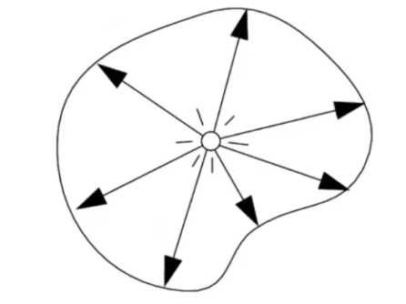

Definition: The radiant(luminous) intensity is the power per unit **solid angle** emitted by a point light source.
$$
I(\omega) = \frac{\mathrm{d} \Phi}{\mathrm{d} \omega}[\frac{W}{sr}][\frac{lm}{sr} = cd = candela]
$$
单位立体角上的power，也就是单位时间单位立体角的Radiance Energy。

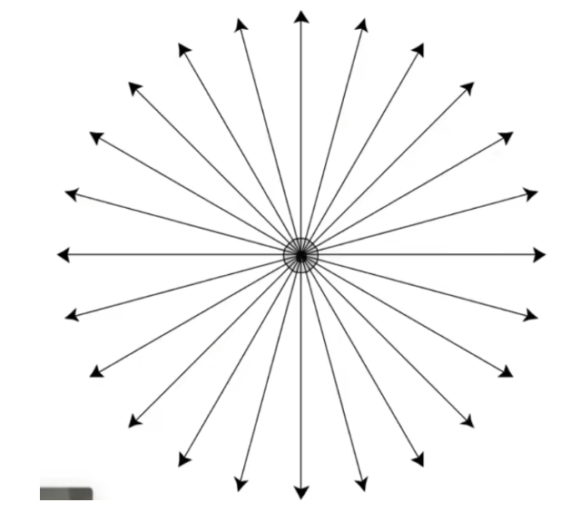

假设我们知道了光源的radiant flux后，假设光源向每个方向均匀释放能量，那么我们除以球的立体角得到的就是每个方向上的flux，也就是radiant intensity；

当对所有方向上的radiant intensity进行积分时，得到的就是光源的radiant flux
$$
\Phi = 	\int_{S^2} I \mathrm{d}\omega = 4\pi I \\
I = \frac{\Phi}{4\pi}
$$

# Irradiance

照度

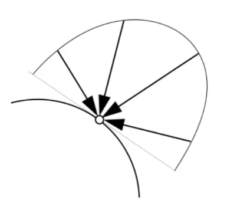

Definition: The irradiance is the power per(perpendicular/ projected) unit area incident o a surface point.
$$
E(x) = \frac{\mathrm{d}\Phi(x)}{\mathrm{d}A}[\frac{W}{m ^ 2}][\frac{lm}{m ^ 2} = lux]
$$
简单来讲，就是单位面积上的radiant flux。

在Blinn-Phong中，我们提到过一个面接受的光的能量会随着离光源的距离而越来越小，跟1 / r ^ 2成正比。我们使用irradiance来解释。

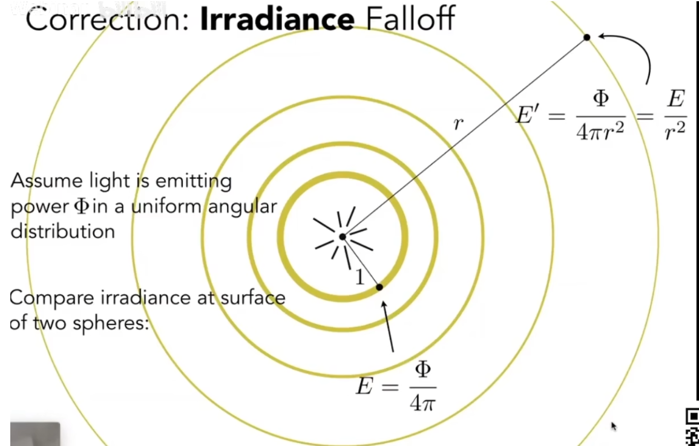

在半径为1的时候，它的irradiance可以求出来，此时的面积就是4π1²，如果半径为r此时的面积就是4πr²，irradiance变小了。

intensity没有变化，因为立体角没有变。

## Lambert's Cosine Law

郎伯余弦定理

朗伯余弦定律是一个描述理想“漫反射”表面或光源辐射特性的物理定律，它表明一个表面上的照度（或辐照度）与入射光线的角度的余弦值成正比。

具体来说，朗伯余弦定律指出，入射光的有效强度（即对表面实际产生照明效果的部分）与光线入射角的余弦成正比。这意味着，当光线垂直（正交）照射到表面上时（即入射角θ=0°，cosθ=1），表面接收到的光强度最大。随着入射角的增大（即光线越来越倾斜），表面接收到的有效光强度减小，因为光线实际照射到的面积增加，光强度分散。

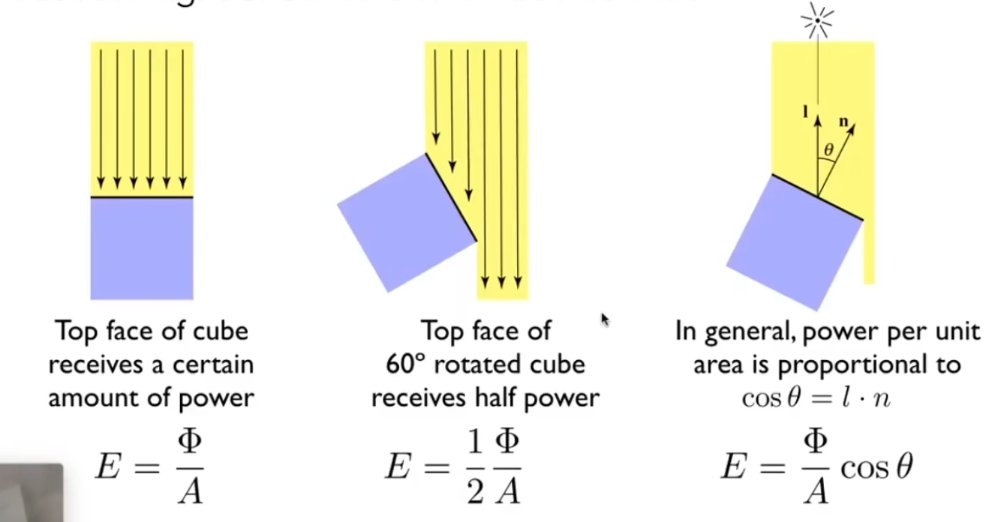

在Blinn-Phong模型中我们也提到过。

# Radiance

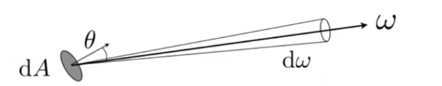

Definition: The radiance(luminance) is the power emitted, reflected, transmitted or received by a surface, **per unit solid, per projected unit area.**
$$
L(p,\omega) = \frac{\mathrm{d ^ 2}\Phi(p,\omega)}{\mathrm{d}\omega\mathrm{A}\cos\theta}
[\frac{W}{sr*m ^ 2}][\frac{cd}{m ^ 2} = \frac{lm}{sr * m ^ 2} = nit]
$$
irradiance是单位面积的power，intensity是单位立体角的power

radiance是单位立体角的irradiance，radiance是单位面积的intensity

**Irradiance vs. radiance**

irradiance是单位面积接受的总能量

radiance是单位面积从某个方向dωi接受的能量

看下图中的单位半球

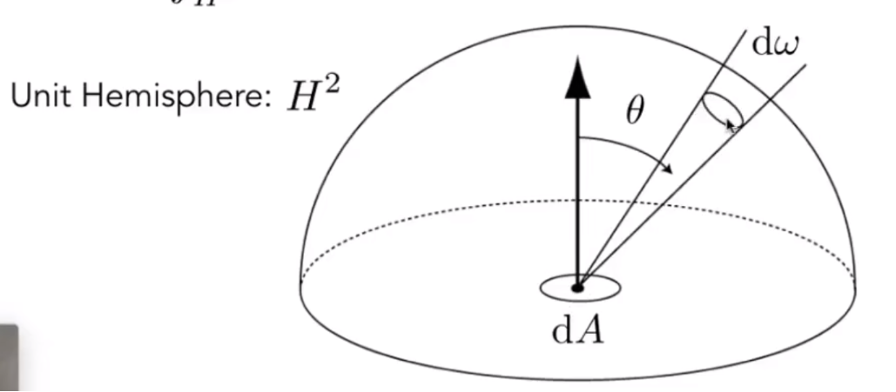
$$
\mathrm{d}E(p, \omega) = L_i(p, \omega)\cos\theta\mathrm{d}\omega\\
E(p) = \int_{H ^ 2}L_i(p, \omega)\cos\theta\mathrm{d}\omega
$$
有cosθ是考虑了郎伯余弦定律。

对于某个方向ω来的一条光线，此光线的radiance是Li(p, ω)，射到了单位面积dA，那么这个单位面积dA接受的能量为Li(p, ω)cosθ。

那么将所有的半球方向内的ω进行积分，就得到了这个单位面积dA接受的总能量E(p)

而我们对上面的式子进行变换
$$
\frac{\mathrm{d}E(p, \omega)}{\mathrm{d}\omega} = L_i(p, \omega)\cos\theta
$$
上面的式子表示的就是单位立体角的irradiance，这是radiance的定义，变换式子就可以得到。

通过这个例子，应该能更好地理解irradiance与radiance之间的关系。