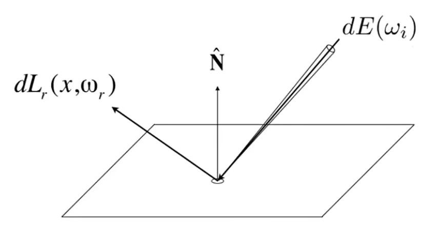
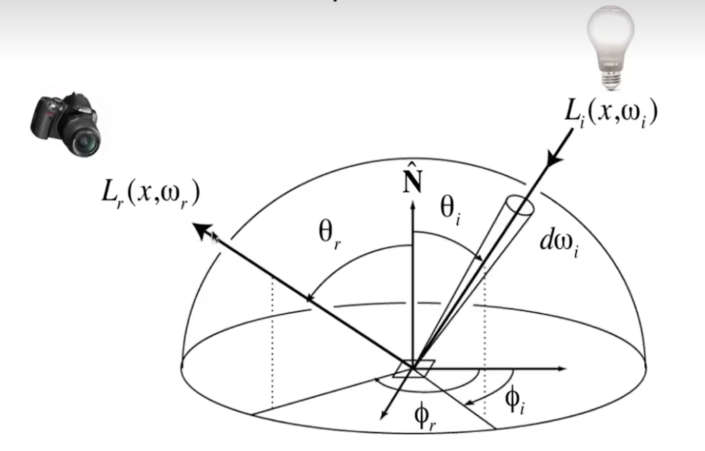
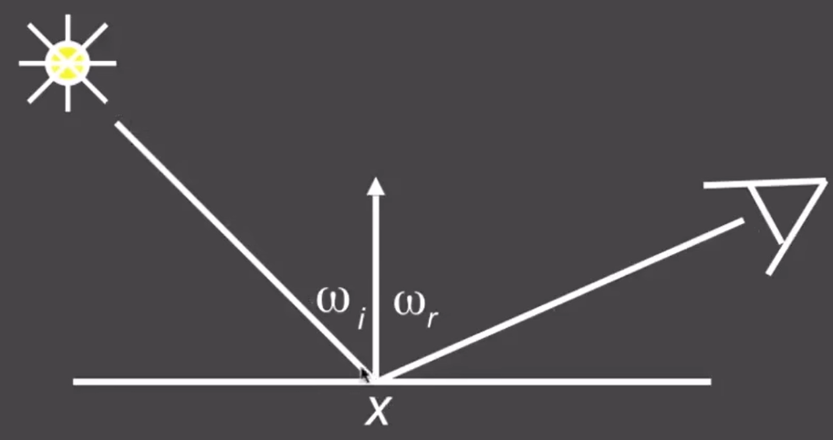
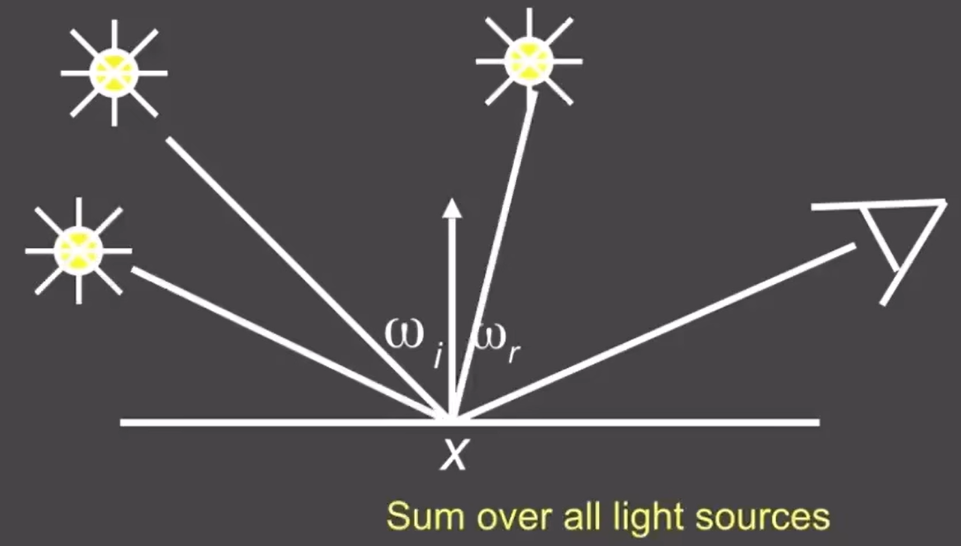
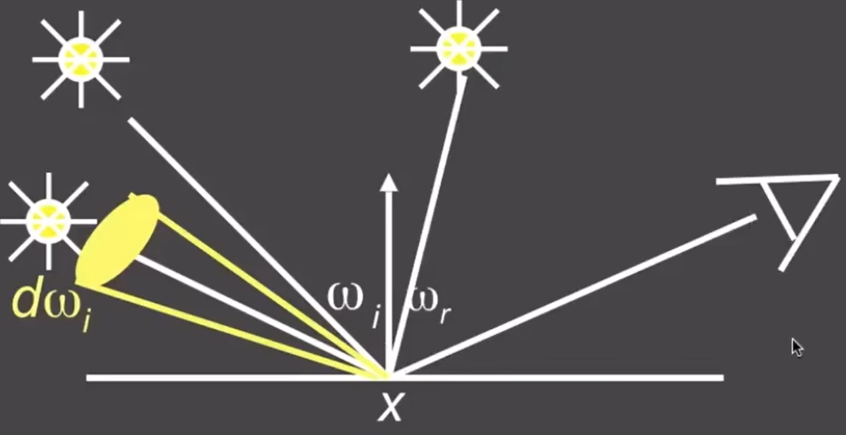
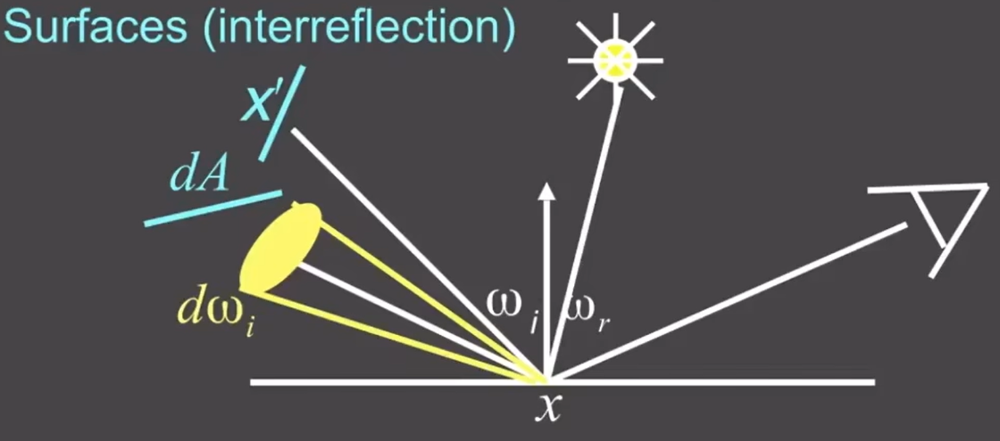

> Date of Study: 3 / 3 / 2024
>
> Time of Study: 145 mins
>
> 渲染方程描述了光在场景中的传播方式，包括光线如何被场景中的表面吸收、反射和散射，从而形成观察者所见的最终图像。通过解决渲染方程，可以理论上获得完全真实的视觉模拟，这使得光线追踪成为生成高度逼真图像的强大工具。
>
> Reference：GAMES101https://www.bilibili.com/video/BV1X7411F744/?spm_id_from=333.337.search-card.all.click

# Bidirectional Reflectance Distribution Function

我们已经学习了辐射度量学，现在我们从辐射度量学的角度来理解光的反射。

ω我们定义的是单位方向角，因为其极小，所以我们认为是一个方向。

那么上述的过程是从ωi方向来的radiance为L(ωi)的光线照射到了一个极小的面积dA上，接受的能量irradiance为
$$
\mathrm{d}E(ω_i) = L(\omega_i)\cos\theta\mathrm{d}\omega_i
$$
cosθ是该极小面积或者说该点的法线N与方向ωi之间的夹角。

一个点接受光线之后，有时不会全部接受，会发射一部分能量。那么从该点向方向ωr辐射的光的radiance为

dLr(x, ωr)。

理解这个过程后，我们知道不同的材料吸收释放的能量肯定是不同的。比如黑色衣服会吸收全部的光，绿色衣服会吸收除绿色外所有的光，我们需要一个统一的表达，来表示这个材料吸收了从ωi方向的L(ωi)后，向任一方向ωr释放的L(ωr)是多少。

这个表达就是双向反射分布函数**Bidirectional Reflectance Distribution Function**

BRDF定义了一个给定的表面，当其被入射光（来自方向ωi）照射时，沿某个反射方向ωr反射多少光线。具体来说，BRDF是一个比值，描述了入射光线的辐照度（或光照强度）和反射光线的辐射亮度（或反射强度）之间的关系，可以表示为：
$$
f_r(\omega_i, \omega_r) = \frac{\mathrm{d}L(\omega_r)}{\mathrm{d}E(\omega_i)}
$$

- fr(ωi, ωr)是BRDF函数，依赖于入射方向ωi和反射方向ωr。

- dL(ωr) 是沿反射方向ωr的微小辐射亮度增量。

- dE(ωi) 是入射光线的微小辐照度增量。

BRDF的核心作用是：

- **能量守恒**：确保反射光线的能量不会超过入射光线的能量。
- **方向性**：反映材料对不同入射和反射方向上光线反射能力的差异。
- **颜色和材质**：通过不同波长光线的BRDF值，可以模拟材料的颜色和质感特性。

> BRDF（双向反射分布函数）在代码中的实现会根据不同的材料特性进行不同的处理。如**理想漫反射（Lambertian）材料**、**镜面反射材料**、**复合材料**的等等

# The Reflection Equation

有了BRDF后，假设我们从方向ωr观察点p，那么我们就能计算点p辐射到方向ωr的能量，进而求出这一个交点颜色。
$$
L_r(p, \omega_r) = \int_{H^2}f_r(p,\omega_i\rightarrow \omega_r)L_i(p,\omega_i)\cos\theta_i\mathrm{d}\omega_i
$$
这个式子很好理解，上面讲解BRDF时，我们只考虑一个一个入射角的光，打到这个平面的光不只在一个入射角，如果考虑了全部的入射角，那我们得到了平面在ωr方向反射的Lr(ωr)

而这个等式就是反射方程**reflection equation**

反射方程提供了一个框架，用于计算一个给定点 \(p\) 上，沿着某个方向反射到观察者眼中的光亮度。这个方程考虑了所有可能的入射方向 对点 p 的贡献，包括直接光照和间接光照（反射光）。

如果我们仔细观察，会发现反射方程是一个递归的过程，要求得Lr，必须知道Li。

光源发射的光一般是一个已知量，而未知的是光源发射光线到达一个物体1，物体1再反射光线到达点p，那么物体1反射的光Li也需要通过反射方程来求得。所以这是一个递归的过程。

那么会有情况使得递归的深度很高甚至无法停止，我们需要处理这种情况；之后我们会谈到。

# The Rendering Equation

反射方程考虑了所有可能的入射方向 对点的贡献，但物体自身可能也会发光，加上自身发光，就是渲染方程rendering equation
$$
L_o(p, \omega_o) = L_e(p, \omega_o) + \int_{\Omega_+}L_i(p, \omega_i)f_r(p, \omega_i, \omega_o)(n·\omega_i)\mathrm{d}\omega_i
$$
这里ω代表的方向与Blinn-Phong模型相同，都是从光线击中的交点指向光源。

反射方程中的积分只对半球积分，反射方程中的cosθ在渲染方程中写成了向量点乘n·ωi

## Understanding the rendering equation

只有一个点光源的情况

渲染方程可以写为
$$
L_r(x, \omega_r) = L_e(x, \omega_r) + L_i(x, \omega_i)f(x, ω_i,\omega_r)(\omega_i·n)
$$
有多个点光源的情况，渲染方程可以写为

$$
L_r(x, \omega_r) = L_e(x, \omega_r) + \sum{L_i(x, \omega_i)f(x, ω_i,\omega_r)(\omega_i·n)}
$$
如果是面光源，我们就将其看作是点光源的集合，使用积分，积分这个面就可以解决

$$
L_r(x, \omega_r) = L_e(x, \omega_r) + \int_{\Omega}{L_i(x, \omega_i)f(x, ω_i,\omega_r)\cos\theta_i\mathrm{d}\omega_i}
$$
如果是其他物体反射过来的光，我们就将这个物体当成是一个面光源来考虑

$$
L_r(x, \omega_r) = L_e(x, \omega_r) + \int_{\Omega}{L_r(x', -\omega_i)f(x, ω_i,\omega_r)\cos\theta_i\mathrm{d}\omega_i}
$$

> 这里有个-ωi需要注意，没有写错

如果我们简写这个渲染方程
$$
l(u) = e(u) + \int l(v)K(u,v)\mathrm{d}v
$$
l(u)是表示在点 u 上的光亮度，e(u)是u点的自身发光，而剩下的积分部分表示了表示所有从点 v 反射到点 u 的光亮度的积分，其中 K*(*u*,*v) 是一个核函数，代表了从 v 到 u 的光传输效率，包括了BRDF和几何项（比如 cosθi）。

再继续简写
$$
L = E + KL
$$
L是一个表示场景中所有点光亮度的向量，是一个表示所有点直接光源光亮度的向量，K是一个矩阵，表示场景中任意两点之间的光传输效率。这个方程表明，观察到的光亮度L是直接光亮度E加上由其他所有点的光亮度通过K传输后的结果。
$$
L = E + KL\\
IL-KL = E\\
(I-K)L = E\\
L = (I-K)^{-1}E
$$
L等于单位矩阵I*L，所以把L都弄到左边，把其他移到右边后，得到的式子

这个式子不好理解，但是可以使用类似泰勒展开的形式
$$
L = (I + K + K^2 + K ^ 3  ...)E\\
L = E + KE + K^2E + K ^ 3E + ...
$$
这个结果我们就很好理解了，E我们直接看到光源的能量，KE就是光源经过物体反射一次，再让我们我们看到的光，是直接光照，从K²开始都是间接光照，K²举例就是从光源照到镜子被反射，反射光再照到物体被反射再让我们看到。

全局光照就是直接+间接光照

光栅化只能看到物体自发光和光源的光反射到物体再到摄像机的光。