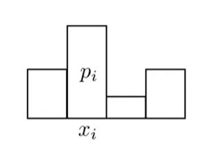
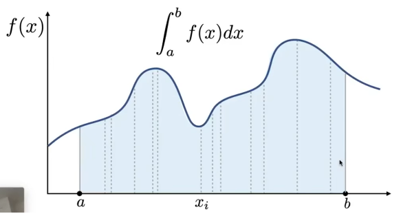
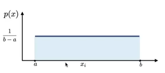

> Date of Study: 3 / 3 / 2024
>
> Time of Study: 54 mins
>
> 之前我们已经学习了渲染方程，但是我们发现渲染方程中计算间接光照的那个积分并不是很好求，蒙特卡洛积分/蒙特卡洛估计就是用来求解那样的复杂积分。
>
> Reference:GAMES101课程https://www.bilibili.com/video/BV1X7411F744/?spm_id_from=333.337.search-card.all.click

# Probability Review

## Random Variables

X: 随机变量，它将随机实验的每一个可能的结果映射到一个实数。

1. **离散随机变量**：当随机变量的可能取值是可数的（例如，整数集合），则该随机变量称为离散随机变量。离散随机变量的例子包括掷骰子的结果（1到6）、一次考试的合格与不合格状态，或者一本书的页码数。
2. **连续随机变量**：当随机变量可以取一个区间内的任何值时，它被称为连续随机变量。连续随机变量的例子包括一个人的身高、一段时间内的降雨量，或者一辆车从一点到另一点所需的时间。

X~p(x): 概率密度函数（Probability Density Function, PDF）表示连续随机变量的概率分布

每个随机变量都有一个与之关联的概率分布，描述了其所有可能取值的概率。对于离散随机变量，这个概率分布通常由概率质量函数（PMF）给出，它为变量的每个可能值指定了一个概率。对于连续随机变量，概率分布通常由概率密度函数（PDF）描述，这是一个函数，其在任何给定区间上的积分都给出了变量落在该区间内的概率。

举例：掷骰子

X的可能取值为1，2，3，4，5，6

p(1) = p(2) = p(3) = p(4) = p(5) = p(6)

## Probabilities

上图表示实验结果是离散值xi的概率为pi
$$
p_i >= 0\\
\sum^{n}_{i = 1}p_i = 1
$$
对于上面提到的掷骰子的例子，pi = 1/6

## Expected value of a random variable

随机变量的期望值
$$
E[X] = \sum^{n}_{i = 1}x_ip_i
$$
对于连续随机变量及其概率密度函数X~p(x)

**Condition on p(x)**
$$
p(x) >= 0 \\
\int p(x)\mathrm{d}x = 1
$$
**Expected value of X**
$$
E(x) = \int xp(x)\mathrm{d}x
$$

## Function of a Random Variable

随机变量X的函数Y仍然是随机变量
$$
Y = f(X)
$$

$$
E(Y) = E(f(X)) = \int f(x)p(x)\mathrm{d}x
$$

# Monte Carlo Integration/estimator

对于简单的定积分，我们可以解出定积分的数值；然而，有时候积分可能很难（或不可能）通过解析方法求解，这时候我们可以使用蒙特卡洛估计。

蒙特卡洛积分是一种利用随机抽样来近似求解定积分的方法，特别适用于高维积分问题。它基于大数定律，即随着试验次数的增加，样本平均值将趋近于期望值。蒙特卡洛方法通过随机抽样来估计一个区域的面积或体积，从而计算积分的值。

在蒙特卡洛估计中，我们定义一个随机变量Xi，它服从概率密度函数p(x)。这意味着每个Xi 都是从概率分布p(x)中随机抽取的。为了估计定积分，我们使用了以下的蒙特卡洛估计器FN:

$$
F_N = \frac{1}{N} \sum_{i=1}^N \frac{f(X_i)}{p(X_i)}
$$
其中，N是随机样本的数量，f(Xi) 是在第 i 个样本点的函数值，p(Xi)是第  i  个样本点的概率密度。

假如我们使用的概率密度是常数
$$
X_i\sim p(x) = C
$$

$$
\int^{b}_{a}p(x)\mathrm{d}x = 1\\
\int^{b}_{a}C\mathrm{d}x = 1\\
C = \frac{1}{b-a}\\
p(x) = \frac{1}{b-a}
$$
带入蒙特卡洛估计中，我们就得到了使用常数的概率密度函数得到的蒙特卡洛估计
$$
F_N = \frac{b - a}{N} \sum_{i=1}^N{f(X_i)}
$$
几点需要注意

- 采样越多，结果越准确
- 对x采样，肯定就是对x积分
