> Date of study: 3 / 4 / 2024
>
> Time of Study: 151mins
>
> whitted-style ray tracing存在问题，仍不能满足对真实感的需求。现在我们利用学过的渲染方程，找到一种新的光线追踪方式路径追踪，并解决其中的诸多问题。
>
> Reference:GAMES101课程https://www.bilibili.com/video/BV1X7411F744/?spm_id_from=333.337.search-card.all.click

# Whitted-style Ray Tracing Problems

我们之前学习过Whitted-style ray tracing，其中当光线打到光滑表面时按照物理规律进行反射折射继续传播，而打到粗糙表面时发生漫反射停止传播。这样做是否正确？

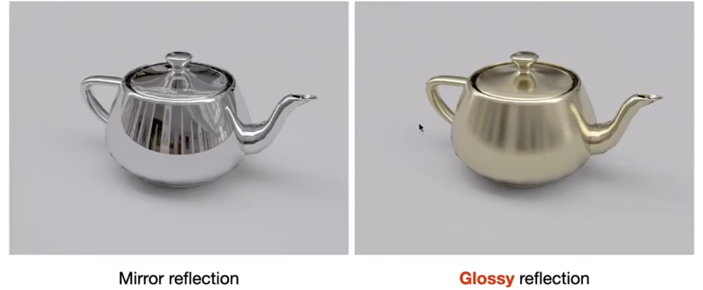

假如有Glossy材质，这种材质介于完全光滑的镜面和完全粗糙的漫反射表面之间。这种类型的表面会产生模糊的反射，而不是像镜面那样的锐利反射。这是因为光泽表面虽然相对光滑，但仍然有足够的微观结构来散射入射光，从而在一定范围内分散反射角。

Whitted-style ray tracing在处理反射和折射时，通常假设光线在一个非常精确的角度反射或折射，这与glossy表面的物理现象不符。因此，直接应用Whitted的方法到glossy表面，会产生不真实的、过于锐利的反射，而不能正确模拟出glossy表面特有的模糊反射效果。

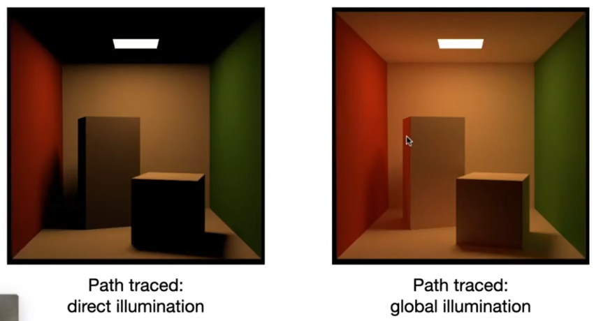

上图中，整个的场景布局全部使用了漫反射材质，假如光线发生漫反射时停止传播，就会产生图一的效果。上面的天花板都黑了，没有光，显然是不正确的。而图二是光线发生漫反射后不停止的结果，明显更加真实。

所以光线到达漫反射面时不应该停止，还应该继续追踪光线的漫反射路径。

# Path Tracing

既然whitted风格的光线追踪是错误的，那什么是正确的?

渲染方程是正确的。问题就是求解渲染方程的积分，以及递归追踪光线路径。
$$
L_o(p, \omega_o) = L_e(p, \omega_o) + \int_{\Omega_+}L_i(p, \omega_i)f_r(p, \omega_i, \omega_o)(n·\omega_i)\mathrm{d}\omega_i
$$

## Direct illumination

求解这个复杂积分的数值，就是用蒙特卡洛积分。

举一个简单的例子

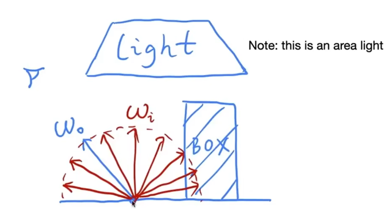

假设此点没有自发光。我们先求出直接光照，先不求间接光照。

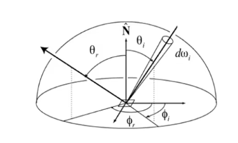
$$
L_o(p, \omega_o) = \int_{\Omega_+}L_i(p, \omega_i)f_r(p, \omega_i, \omega_o)(n·\omega_i)\mathrm{d}\omega_i
$$
选择的随机变量为一个方向（单位立体角）ωi。接下来需要找到我们要积分的函数式f(x)以及随机变量遵循的概率密度函数p(x)

很明显，函数式f(x)为
$$
L_i(p, \omega_i)f_r(p, \omega_i, \omega_o)(n·\omega_i)
$$
概率密度函数，也就是我们选择不同的ωi的概率。如果我们使用均匀采样，那就是在一个单位半球面积上均匀采样，所以
$$
p(\omega_i) = \frac{1}{2\pi}
$$
按照蒙特卡洛积分
$$
L_o(p, \omega_o) = \int_{\Omega_+}L_i(p, \omega_i)f_r(p, \omega_i, \omega_o)(n·\omega_i)\mathrm{d}\omega_i
\\
\approx\frac{1}{N}\sum^{N}_{i = 1}\frac{L_i(p, \omega_i)f_r(p, \omega_i, \omega_o)(n·\omega_i)}{p(\omega_i)}
$$
 现在我们就可以将求解直接光照的伪代码写出来

```
shade(p, ωo)
{
	Randomly choose N directions wi~pdf
	Lo = 0.0
	For each wi
		Trace a ray(p, wi)
		If ray r hit the light
			Lo += (1/N) * Li * fr * cosine / pdf(wi)
	return Lo
}
```

求解p点对wo方向的光照，则先从p点的半球中选择N的方向wi~pdf，对于每个方向，做一条射线起点为p方向为wi，如果光线击中了光源（只有击中光源才说明光源有光照到了这个点），使用蒙特卡洛积分计算直接光照。

## Indirect illumination

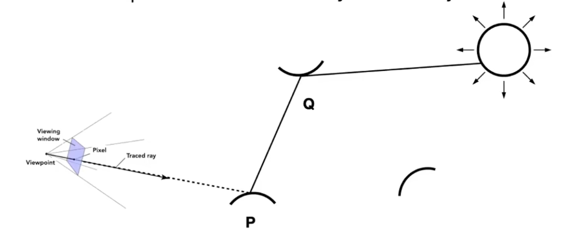

下面考虑间接光照

按照蒙特卡洛积分的采样，如果我们采样的方向wi形成的光线打到了物体Q上，那么我们需要求物体Q对方向-wi的光照。反过来理解，就是光源的光打到Q点后，Q点再反射到P点的光。

```
shade(p, ωo)
{
	Randomly choose N directions wi~pdf
	Lo = 0.0
	For each wi
		Trace a ray(p, wi)
		If ray r hit the light
			Lo += (1/N) * Li * fr * cosine / pdf(wi)
		Else if ray r hit an object at q
			Lo += (1/N) * shade(q, -wi) * fr * cosine / pdf(wi)
	return Lo
}
```

问题1：计算量

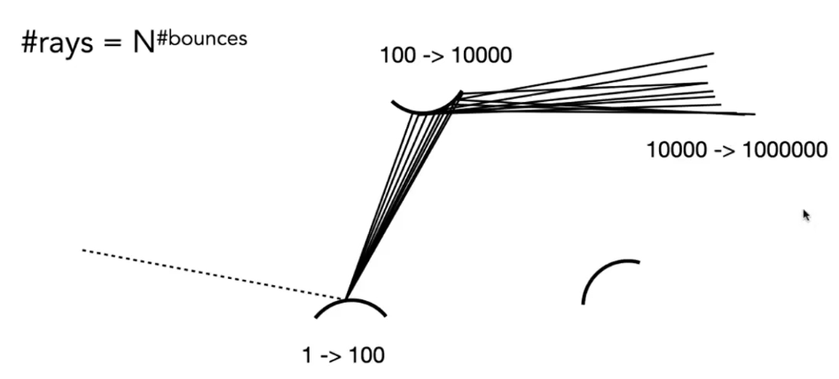

如果一根光线打到物体上，会反射出多条光线，而恰巧这些光线全部打到了其他物体，那么光线数量就会指数级增长，计算量直接爆炸。

产生的光线数量为
$$
raysnum = N ^ {bounces}
$$
N指的是一根光线经过一次弹射后形成的光线数量（也就是蒙特卡洛积分采样时采样的方向数量），bounces指的是弹射的次数。

我们不能限制光线弹射几次停止，这不符合物理规律。我们只能限制N。

N为2可以吗？也不行，2的指数级仍然是一个很大的数。我们只能让N = 1。

```
shade(p, ωo)
{
	Randomly choose one direction wi~pdf
	Trace a ray r(p, wi)
	If ray r hit the light
		return Li * fr * cosine / pdf(wi)
	Else if ray r hit an object at q
		return shade(q, -wi) * fr * cosine / pdf(wi)
}
```

n=1的蒙特卡洛积分情况，我们叫做路径追踪Path Tracing。n!=1的情况叫做分布式光线追踪

如果N = 1时，会不会导致结果的不正确（噪声大）。但我们可以让摄像机从一个像素点投射多条光线，光线结果共同影响这个像素，求平均就是最终结果。

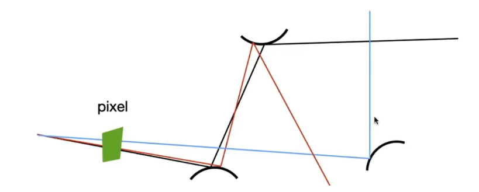

```
ray_generation(camPos, pixel)
{
	Uniformly choose N sample positions within the pixel
	pixel_radiance = 0.0
	For each sample in the pixel
		Shoot a ray r(camPos, cam_to_sample)
		If a ray r hit the scene at p
			pixel_radiance += 1 / N * shade(p, sample_to_cam)
	return pixel_radiance
}
```

给定摄像机位置和像素，在像素中选取n个位置，也就是采样n次，对于每一次采样，从摄像机到这个采样点射出光线，如果这个光线打到物体的点p，就要求点p在这个方向的radiance。


问题二：递归不会停止

我们不能具体限制光线弹射的次数，真实情况下光会弹射无数次，直接限制会丢失能量，不符合自然规律，成像结果可能不正确。

解决方法：**俄罗斯轮盘赌(Russian Roulette RR)**

1. **选择终止概率**：每次光线与物体交互时，算法会计算一个概率值，决定这条路径是否继续。这个概率值通常基于光线的能量或物体的反射特性来确定。
2. **随机决策**：使用随机数生成器产生一个随机数，如果这个随机数小于前一步计算的概率值，则继续追踪光线；如果大于或等于概率值，则终止当前路径的追踪。

一个左轮，如果我们在其中添加2颗子弹后对自己开枪，生存的概率就是4/6;对于一根光线，每次弹射相当于开一次枪，如果射出了子弹，光线的弹射就要停止。也就是以一定的概率停止该光线的追踪。

如何保证能量守恒？为了保证图像的能量守恒，如果决定继续追踪路径，算法会对光线的贡献进行适当的放大，以补偿因概率性终止而丢失的路径。

我们想要确定一个点的结果Lo；确定一个概率P

有P的概率递归继续，那我们返回**Lo / p**；有1-P的概率递归终止，则我们返回0。

那么结果的期望值
$$
Lo = p * Lo/p + (1 - p) * 0 = Lo
$$

```
shade(p, ωo)
{
	Manually specify a probability P_RR
	Randomly select ksi in a uniform dist. in [0, 1]
	If (ksi > P_RR) return 0.0
	
	
	Randomly choose one direction wi~pdf
	Trace a ray r(p, wi)
	If ray r hit the light
		return Li * fr * cosine / pdf(wi) / P_RR
	Else if ray r hit an object at q
		return shade(q, -wi) * fr * cosine / pdf(wi) / P_RR
}
```

全部问题解决，这是一个正确的单向路径追踪算法。

## More efficient

算法虽然正确，但是实际使用时，当每个像素点的采样数（SPP）高时，渲染的时间会很长；而SPP低时，得到的结果不会很好。

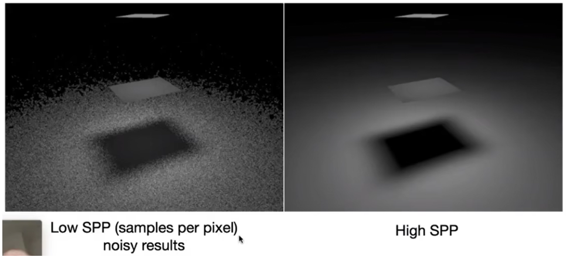

问题出在了哪里？

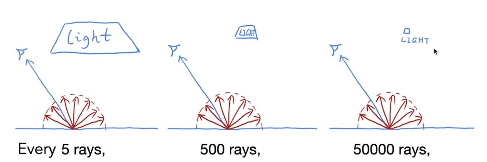

上图展示了不同的光源大小，平均采样多少根光线才能打到光源。不同的光源大小，对于光线能否到达光源的影响很大。

我们之前限制了光线只有1根，所以我们用蒙特卡洛积分求一个物体的radiance时，只会均匀采样出一根光线，但是这个光线打不打得到光源完全是看运气的，有很多情况就直接浪费掉了。所以我们需要改变采样方法。


如果我们能保证，光线一定能够打到光源，那这跟光线绝对不会浪费。所以我们需要改变采样策略，从对半球的方向均匀采样改为直接向光源均匀采样。

假设对一个面积为A的光源均匀采样，那么我们能求出采样概率密度函数为
$$
\int pdf\mathrm{d}A = 1\\
pdf = 1 / A
$$
但之前我们在讲解蒙特卡洛积分时提到过，对谁采样，也就应该对谁积分。但现在的渲染方程是对方向角ω积分，所以我们需要找到dω与dA之间的关系，对渲染方程进行变形。

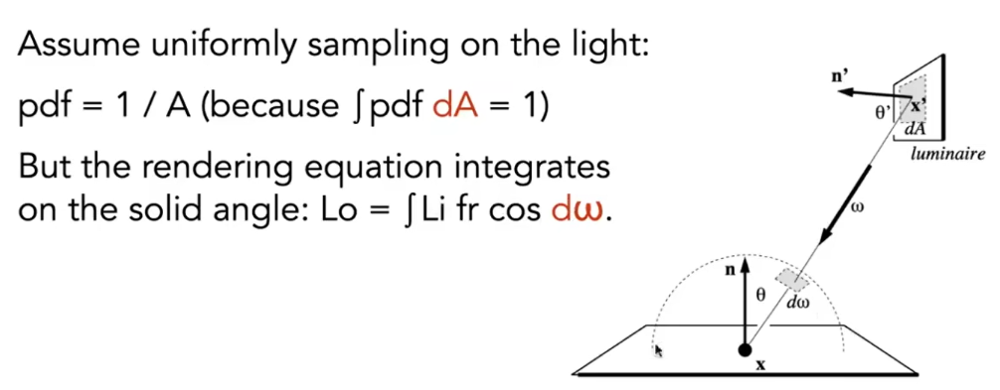

对于光源上的一小块面积dA，我们用它的法线n‘代表其方向。

要求出面积和立体角的关系，我们需要将面积转化为立体角。

根据立体角公式

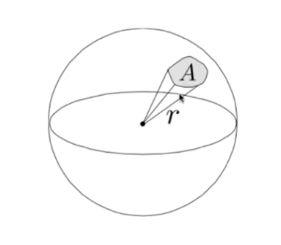
$$
\Omega = \frac{A}{r ^ 2}
$$
我们首先要求出面积A。

dA肯定不能直接用，因为dA没有在球面上。应该将dA投影到球面上。我们使用一个面的法线n来表示这个面的方向。

要求出dA在方向ω上的投影（如上图），则
$$
dA_p = dA\cos\theta'
$$
θ'是dA的法线n’与方向ω的夹角。

接下来是球的半径r。

是图中半球的半径吗？ 显然不是，应该是面积dAp的中心点x'与圆心x的长度。

所以dA与dω之间的关系为
$$
d\omega = \frac{\mathrm{d}A\cos\theta'}{\left \| x-x' \right \|^2 }
$$
有人可能会说，这个立体角是大球的立体角，不是之前均匀采样的那个半球的立体角。但实际上立体角与球半径无关，我们求得的这个立体角也等同于半球的立体角。

直接改写渲染方程
$$
Lo = \int_{A}L_i(p, \omega_i)f_r(x, \omega_i, \omega_o)\frac{\cos\theta\cos\theta'}{\left \| x-x' \right \|^2}\mathrm{d}A \\
\approx\frac{1}{N}\sum^{N}_{i = 1}\frac{L_i(p, \omega_i)f_r(x, \omega_i, \omega_o)\frac{\cos\theta\cos\theta'}{\left \| x-x' \right \|^2}}{pdf}
$$
其中pdf之前已经讨论过。
$$
pdf = 1 / A
$$

## Summary

对于一个点向一个方向的直接光照（不考虑自发光），可以分为两部分

- 一部分是光源直接的光照，这部分没有光线的弹射，所以用不到俄罗斯轮盘赌，使用对光源直接采样的渲染方程和蒙特卡洛积分求

- 一部分是其他物体的间接光照，需要使用俄罗斯轮盘赌来让光线以一定概率停下，并使用均匀采样的渲染方恒和蒙特卡洛积分求

```
shade(p, ωo)
{
	//direct illuminition
	Uniformly sample the light at x'(pdf_light = 1 / A)
	L_dir = L_i * f_r * cosθ * cosθ' / |x' - p|^2 / pdf_light
	
	//indirect illuminition
	L_indir = 0.0
	Test Russian Roulette with probability P_RR
	Uniformly sample the hemisphere toword wi (pdf_hemi = 1 / 2)
	Trace a ray r(p, wi)
		If ray r hit a non-emitting object at q
			L_indir = shade(q, -wi) * f_r * cosθ * / pdf_hemi / P_RR
			
	return L_dir + L_indir
	
}
```

最后最后的一点点小问题，考虑光源与物体连线被遮挡的情况

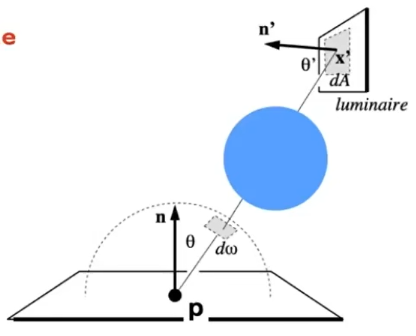

```
shade(p, ωo)
{
	//direct illuminition
	L_dir = 0.0
	Uniformly sample the light at x'(pdf_light = 1 / A)
	Shoot a ray from p to x'
	If the ray is not blocked in the middel
		L_dir = L_i * f_r * cosθ * cosθ' / |x' - p|^2 / pdf_light
	
	//indirect illuminition
	L_indir = 0.0
	Test Russian Roulette with probability P_RR
	Uniformly sample the hemisphere toword wi (pdf_hemi = 1 / 2)
	Trace a ray r(p, wi)
		If ray r hit a non-emitting object at q
			L_indir = shade(q, -wi) * f_r * cosθ * / pdf_hemi / P_RR
			
	return L_dir + L_indir
	
}
```

至此，完成了路径追踪的全部内容。

我们发现，因为是对光源的面积进行采样，所以如果光源是一个点光源，路径追踪明显处理不了。

如果遇到点光源，尽量将其变为面积很小的面光源。


# Questions

比较原始，previous的光线追踪，指的就是Whitted-style ray tracing


现代的关于光照解决方案包括

- 路径追踪(unidirectional path tracing and bidirectional path tracing 单向路径追踪和双向路径追踪）
- photon mapping光子映射
- metropolis light transport(MLT) 
- VCM/UPBP...


路径追踪中，如何去对一个半球进行均匀采样？或者说一般来讲如何对任意一个函数进行采样?(sampling)

我们使用蒙特卡洛积分时，使用的pdf全是常数，但蒙特卡洛积分允许任意的pdf，哪个pdf是最好的？（importance sampling）

随机数很重要（low discrepancy sequence）

路径追踪中，我们要么对半球采样，要么对光源采样，是否可以将两者结合？多重重要性采样（Multiple Importance Sampling, MIS）。

路径追踪中，我们让摄像机从一个像素点投射多条光线，光线结果共同影响这个像素，求平均就是最终结果。为什么要求平均？（pixel reconstruction filter）

渲染方程中，我们计算的Lo是光线的radiance，如何将radiance转化为像素的颜色？（gamma correction，curves，color space）
