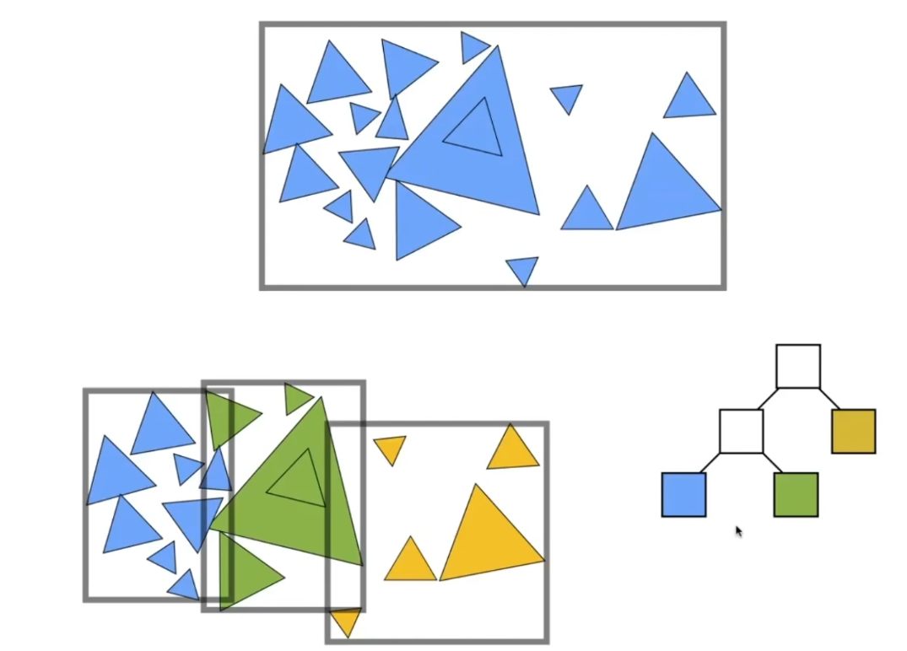

> Date of study : 3 / 4 / 2023
>
> Time of Study:126 mins
>
> 之前，尽管我们已经学习了很多光线追踪的理论知识，但实际应用或者说使用代码实现仍有很多细节需要考虑。本部分着重于光线如何表示，如何计算光线与物体相交以及加速结构。
>
> Reference:GAMES101课程https://www.bilibili.com/video/BV1X7411F744/?spm_id_from=333.337.search-card.all.click

# Ray Equation

光线的定义：光源与方向


$$
r(t) = \textbf{o} + t\textbf{d}~~~~0\le t<∞
$$
t代表的就是时间，o代表光源，td则是向方向d走了t秒。

# Ray - Surface Intersection

## Ray Intersection With Sphere

我们首先以光线与球相交为例（大部分光线追踪器都是以实现渲染各种各样的球开始的）

球的方程为
$$
（\textbf{p}-\textbf{c})^2-R^2 = 0
$$
其中c是原点，R是半径，p则是满足所有方程的点。

要想光线与球相交，则光线经过某一时间t到达的点满足了球的方程。


$$
（\textbf{o}+ t\textbf{d}- \textbf{c}) ^ 2 - R ^ 2 = 0
$$
其中唯一的未知量是t。

这明显是一个一元二次方程，形式为
$$
a ^ 2t + bt + c = 0
$$
将上面的式子展开后，得到的
$$
a = \textbf{d}·\textbf{d} \\
b = 2(\textbf{o} - \textbf{c})·\textbf{d}\\
c =(\textbf{o} - \textbf{c})·(\textbf{o} - \textbf{c})-R ^ 2
$$
根据我们熟悉的不能再熟悉的初中知识，我们知道
$$
t = \frac{-b \pm \sqrt {b ^ 2 - 4ac}}{2a}
$$
并且解有多种情况，需要进行判断。


## Ray Intersection With Implicit Surface

隐式表面的含义是，任何在表面上的点p都满足一个函数式
$$
f(\textbf{p}) = 0
$$
上面讨论的光线与球相交就是隐式表面的一个例子，只需要将光线的表达式带入即可
$$
f(\textbf{o} + t\textbf{d}) = 0
$$
在光线定义时，我们提到过t是大于0的，所以要解出**正实数解**。

## Ray Intersection With Triangle Mesh

目前在计算机图形学和三维建模中，复杂的模型通常是由一个个小三角形（也称为三角面片或三角形网格）组成的。

基于三角形的模型属于“显式几何”(Explicit Geometry)的一种形式，因为它们直接定义了物体的表面几何形状。显式几何通过一系列顶点、边和面（在这种情况下是三角形）的明确数学描述来表示三维形状或物体的结构。


对于光线和三角形相交，一般分为两个部分：

- 三角形也是一个平面，先计算光线与平面相交。
- 如果光线与平面相交，则判断光线是否在三角形内。

### Plane Equation

平面由一个法向量和一个平面上的一个点确定。


$$
(\textbf{p} - \textbf{p'})·\textbf{N} = 0
$$
求解光线与平面相交，则
$$
(\textbf{p} - \textbf{p'})·\textbf{N} = 0 \\
(\textbf{o}+ t\textbf{d} - \textbf{p'})·\textbf{N} = 0\\
t = \frac{(\textbf{p'} - \textbf{o})·\textbf{N}}{\textbf{d}·\textbf{N}}
$$
注意正确的解，t大于等于0

### Moller Trumbore Algorithm

此算法用于通过重心坐标快速确定一个点是否位于三角形内部，以及计算该点在三角形平面上的精确位置。

一个点如果在三角形内部，则一定可以通过**重心坐标**表示，所以此算法求解的是如果交点在三角形内部时，此交点的重心坐标是什么。
$$
\vec{O} + t\vec{D} = (1 - b_1 - b_2)\vec{P_0} + b_1\vec{P_1} + b_2\vec{P_2}
$$
b1，b2，1 - b1 - b2则是三个重心坐标，P0, P1, P2是三角形的三个顶点。

解这个式子用到了克格莫法则。向量都是三维的，相当于有三个方程式，未知数是t，b1，b2 3个未知数。
$$
\begin{bmatrix}
 t\\
 b1\\
 b2
\end{bmatrix}
 = 
 \frac{1}{\vec{S_1}·\vec{E_1}}
 \begin{bmatrix}
\vec{S_2}·\vec{E_2}\\
\vec{S_1}·\vec{S}\\
\vec{S_2}·\vec{D}
\end{bmatrix}
$$
其中
$$
\vec{E_1} = \vec{P_1} - \vec{P_0}\\
\vec{E_2} = \vec{P_2} - \vec{P_0}\\
\vec{S} = \vec{O} - \vec{P_0} \\
\vec{S_1} = \vec{D} \times \vec{E_2}\\
\vec{S_2} = \vec{S} \times \vec{E_1}
$$
最后解一定要合理，t大于等于0，b1b2b3都要非负才能保证在三角形内

# Accelerating Ray-Surface Intersection

一个模型中由很多的三角形，如果我们没有很好的办法，只能让光线与每个三角形计算是否相交，这个计算量很大，所以需要进行优化。

## Bounding Volumes


包围盒，使用一种基本图形将物体包围起来，如果光线没有和包围盒相交，则也不会与里面的物体相交。

常用的包围盒就是立方体包围盒。并且该包围盒都与xyz轴平行。这种包围盒称为轴对齐包围盒"Axis-Aligned Bounding Box"，常简称为 AABB。


我们要换一种思路去看包围盒，将其看成是3对无限大平行面的交集

## Ray Intersection with Axis-aligned Box

我们先用2D为例讲解相交的计算，3D的情况基本相同


如上图，计算光线与x平面进和出的时间tmin和tmax，计算光线与y轴平面进和出的时间tmin和tmax。

取两个tmin中最大的，这是光线进这个2D包围盒的时间

取两个tmax中最小的，这是光线出这个2D包围盒的时间。

3D情况下我们求得的应该是三组时间。同样按这种方法求光线进入包围盒的时间和从包围盒出去的时间。
$$
t_{enter} = max(t_{min})\\
t_{exit} = min(t_{max})
$$
只有三个轴全部进入包围盒，才算光线进入包围盒中。只要光线从任意一轴出包围盒，就算光线出包围盒。

如果t_enter < t_exit，则我们知道光线在包围盒中保持了一段时间，那么一定与包围盒相交。


但是会有情况，求得的时间t为**负值**。我们需要判断t为负值是否由物理意义。

**如果 t_exit < 0**，说明盒子在光线的后面，也就是在光源的后面并且光线的方向没有朝向包围盒，那么就绝对不可能相交。

**如果t_exit >= 0并且t_enter< 0**，说明光源在包围盒内，则与包围盒一定有交点。

总结，如果光线与包围盒交点，满足的情况为
$$
t_{enter} < t_{exit}~ \&\&~t_{exit} \ge 0
$$


为什么一定要使用AABB包围盒？

我们之前提到过光线与平面相交的公式为
$$
t = \frac{(\textbf{p'} - \textbf{o})·\textbf{N}}{\textbf{d}·\textbf{N}}
$$
如果使用AABB，假如对x轴的情况，那么
$$
N_x = (1, 0, 0)\\
t = \frac{(\textbf{p'}_x - \textbf{o}_x)}{\textbf{d}_x}
$$
与轴对齐的性质使得组成包围盒的平面法线N十分简单，进而简化了我们的计算。

## Accelerating with AABB


1. 为场景中的每个物体计算一个轴对称包围盒
2. 在整个场景中创建一个均匀的网格。每个网格单元都是空间的一部分，通常是正方形或立方体。
3. 对于每个物体，确定它的包围盒与哪些网格单元相交，并将该物体存储在与其相交的所有单元格中。


1. **在网格中按照射线穿越的顺序逐步前进**：从射线的起点开始，算法确定射线将经过的网格单元格，并按照射线的方向依次检查这些单元格。
2. **对每个网格单元进行交点测试**：对于射线穿过的每个单元格，如果该单元格有物体，检查射线是否与存储在该单元格中的物体相交。

有一个问题，当如何判断光线下一步要射向哪个网格。

最最简单的做法，如图光线是向右上方打去的，下个格子要么在正右要么在右上角。


分割的网格数量过于密集和过于稀疏都不好，人们根据经验认为27*物体数量的格子比较合适。


该图场景中，物体十分密集，均匀，使用均匀分割网格的方法十分合适。


该图场景中，物体分布稀疏，如果划分成格子，有物体的格子会非常少，大部分都是光线与盒子求交，效率低。

所以我们需要更好的分割方法。

## Spatial Partitions

空间划分技术不仅可以用于划分图形学的场景，还有很多其他领域的应用。


上图中展示了三种分割方法。

第一种分割方法与场景的维度有关，如果是2D场景那就是4叉数，如果是3D场景则是八叉树**Oct-Tree**

Octree的构建过程如下：

1. **初始化**：从包含整个场景的单一节点开始，这个节点代表了整个三维空间。
2. **分割**：当一个节点包含超过预定数量的物体时，它会被分割成八个子节点。每个子节点代表父节点空间的1/8。（如果是2D场景则是4个子节点）
3. **递归**：对每个子节点重复分割过程，直到每个节点的物体数量低于预定的阈值或达到某个最小尺寸。（如上图中的4个大节点，因为左上角物体数量高于预定的阈值所以要继续分割）

但是人们并不喜欢这种分割方式，因为他与维度相关，如果变成更高维，如4维等，树变成了2^n叉。

第二种分割方式为**KD-Tree**

1. **选择轴**：KD-Tree通过轮流在每个维度上选择轴来分割数据。比如，在二维空间中，第一次分割可能沿着x轴，第二次沿着y轴，然后再次沿着x轴，依此类推。
2. **分割数据**：在选定的轴上，数据会根据中值或其他方法（如平均值、中位数）来垂直分割。
3. **递归构建**：这个分割过程递归地应用于所有子集，直到达到某个停止条件，比如子集中的点的数量小于一个阈值，或者树达到了设定的最大深度。

第三种分割方式为**BSP-Tree**

基本原理与KD-Tree相同，唯一不同的是BSP-Tree不是垂直于轴分割，所以很难计算。

### KD-Tree

重点讲解KD-Tree


建立KD-Tree加速结构，图中每次只进行了一次划分，实际上每块区域还需要继续划分。

根节点和父节点ABCD只需要记录格子的划分情况，叶子节点12345存储每个格子所相交的几何形体的情况。

我们需要一个数据结构来存储KD-Tree

内部结点存储

- 分割的轴是x，y还是z轴
- 分割的位置
- 孩子结点的指针

叶子结点存储

- list of objects

进行光线追踪之前我们提前建立好加速结构


当有光线进入并与包围盒相交时，则要递归判断与哪些网格相交。


先判断与1网格是否相交，假设1没有继续划分，则判断光线是否与1网格中的物体是否相交。没有相交则继续递归。


在3网格时找到物体交点，递归结束。


但KD-Tree有一个问题，首先这样划分不好判断网格与物体是否相交。也就是不好判断物体在哪些划分的网格中。

还有一个问题，


如图，一个球属于三个网格，那么三个网格都需要存储这个球的信息。

## **Object Partitions & Bounding Volume Hierarchy（BVH）**



要解决KD-Tree的问题，需要保证每个物体只属于一个包围盒，则可以按照物体划分包围盒。如何划分得更好是BVH重点的研究。


**BVH的建立**

1. 找到整体的包围盒
2. 将物体按照一定规则划分为两个子集
3. 两个子集重新计算包围盒，之后递归
4. 当必要时停止划分，如包围盒中的物体数量达到了预定的阈值
5. 叶子节点存储物体信息

划分的技巧

- 因为需要找到一个轴，并且需要确定一个分割的位置来将大包围盒分为两个子集
- 轴选择最长的那个轴
- 选择最中间的那个三角形进行划分，比如有1 - n个三角形，则选择第n / 2个三角形进行划分。一般三角形的排序是按照重心坐标排序。

**BVH的数据结构**

内部节点存储

- 包围盒
- 孩子结点的指针

叶子节点存储

- 包围盒
- 包含的物体信息

```
Intersect(Ray ray, BVH node)
{
	if (ray misses node.box) return;
	
	if (node is a leaf node)
		test intersection with all objects;
		return closest intersection;
	
	hit1 = intersect(ray, node.lchild);
	hit2 = intersect(ray, node.rchild);
	
	return the closer of hit1, hit2;
}
```

